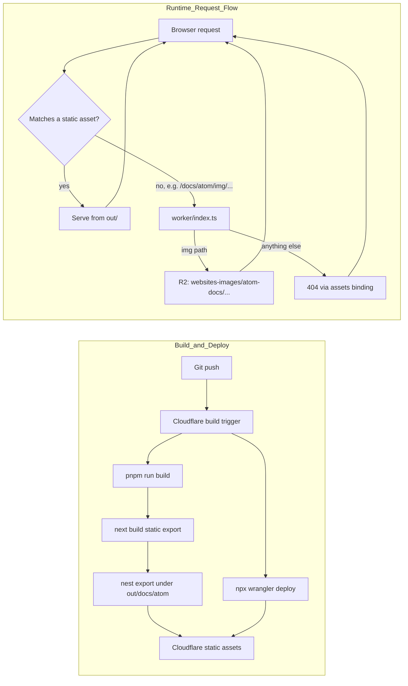

# Atom Docs

Documentation site for Atom, built with Fumadocs and Next.js.

The site is served under `/docs/atom/`.

## Development

```bash
pnpm install
pnpm dev
```

Open http://localhost:3000/docs/atom/ with your browser to see the result.

## Deployment

This site follows the same Cloudflare Workers static-assets pattern used by the FluxMQ docs:

- **Next.js static export** - `next build` outputs static files to `out/`
- **Next.js `basePath`** - links and assets are generated under `/docs/atom`
- **Post-build nesting** - `scripts/nest-static-export.mjs` moves the export under `out/docs/atom/` so Cloudflare static assets can serve it from the route prefix
- **Doc images via R2** - `worker/index.ts` is a small Worker in front of the static assets that serves `/docs/atom/img/...` from a shared Cloudflare R2 bucket instead of the repo, so images can be updated and cache-purged without a rebuild. It only runs as a fallback for requests that don't match a static asset (`run_worker_first: false`, the default) - every actual page is still served directly from `out/` with no Worker involved. See [`scripts/README.md`](./scripts/README.md) for the full picture and the publishing workflow.

### Cloudflare Build Settings

| Setting         | Value                          |
| --------------- | ------------------------------ |
| Build command   | `pnpm run build`               |
| Deploy command  | `npx wrangler deploy`          |
| Version command | `npx wrangler versions upload` |
| Root directory  | `/docs`                        |

### Cloudflare Build Watch Paths

Configure this in the Cloudflare dashboard for the `atom-docs` Worker:

| Setting       | Value    |
| ------------- | -------- |
| Include paths | `docs/*` |
| Exclude paths | empty    |

This keeps the Atom docs Worker from rebuilding when commits only touch files
outside the `docs/` directory.

### Architecture



## Environment Variables

Set this Cloudflare build variable so canonical URLs are embedded into the static output:

```env
NEXT_PUBLIC_BASE_URL=https://www.absmach.eu/docs/atom
```

## Project Structure

| Path                              | Description                                                                    |
| ---------------------------------- | -------------------------------------------------------------------------------- |
| `app/[[...slug]]/page.tsx`        | Docs page renderer                                                             |
| `content/docs`                    | MDX source files                                                               |
| `lib/source.ts`                   | Fumadocs source adapter                                                        |
| `components/doc-image.tsx`        | Renders doc images as a plain, zoomable `` (no `next/image`, no manifest) |
| `worker/index.ts`                 | Serves `/docs/atom/img/...` from R2, falls back to static assets otherwise    |
| `scripts/nest-static-export.mjs`  | Moves static export under `/docs/atom`, strips any local `img/` from it       |
| `scripts/publish-image.mjs`       | Maintainer-only: uploads a doc image to R2 and purges its cache               |
| `wrangler.jsonc`                  | Cloudflare Workers static-assets + Worker + R2 binding config                 |
