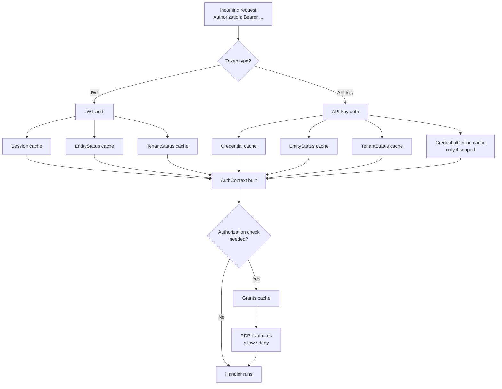
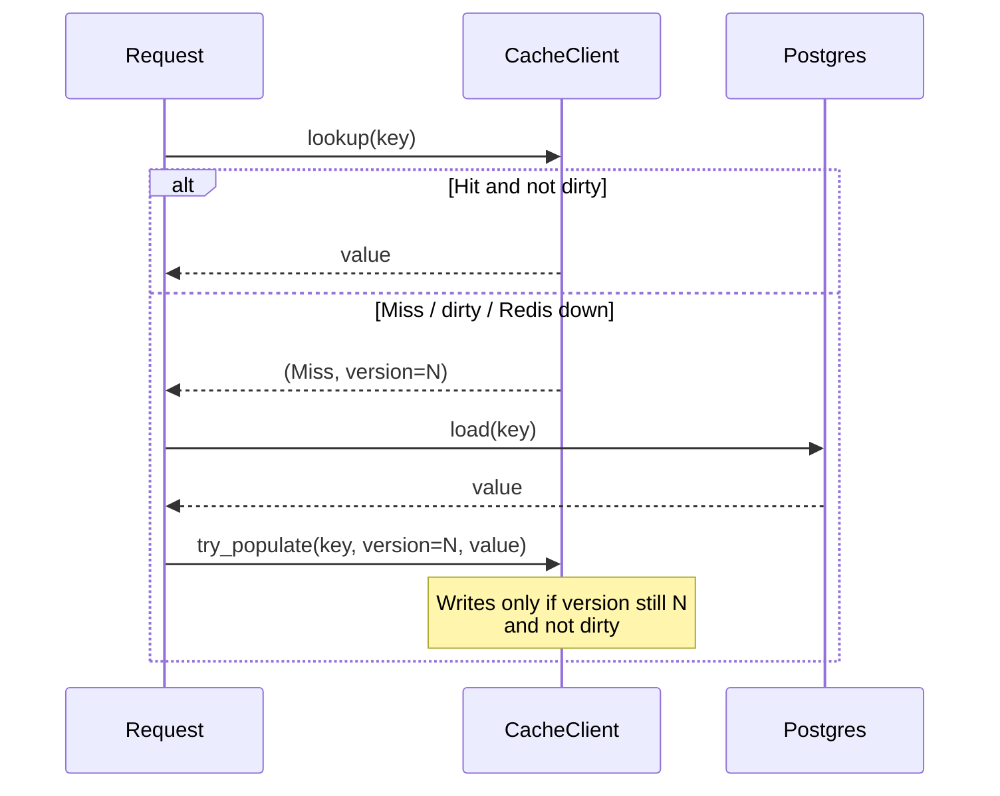
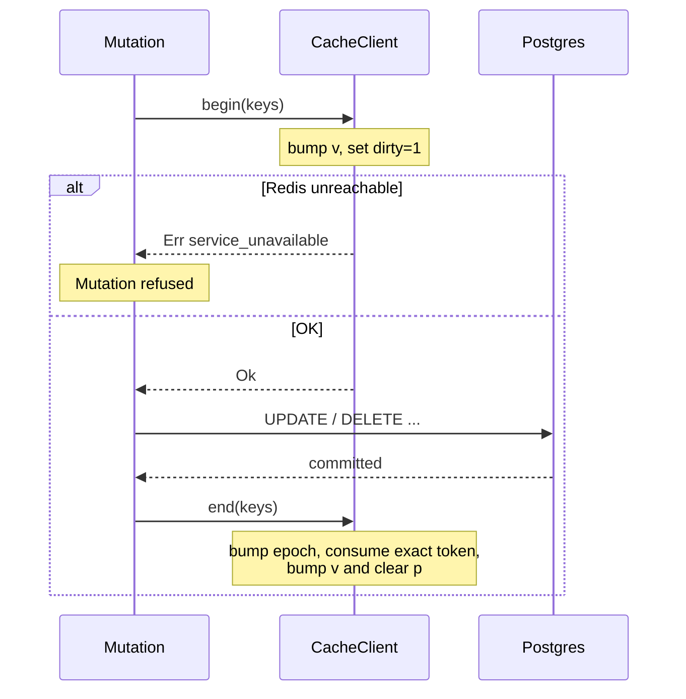

# AuthN / AuthZ Cache

## Status: Active v1
## Date: 2026-07-31

This document describes Atom's Redis-backed cache for authentication and authorization inputs. The source of truth for overall product requirements is [Atom Product Requirements Document](./PRD.md), and authorization terminology is defined in [Atom access model](./11-access-model-simplification.md).

---

## Goal

Atom is often used as an external Identity Provider. Every request from every downstream service hits Atom's auth path. Without a cache, each request costs:

- **JWT auth** — a three-way join (`sessions ⨝ entities ⨝ tenants`).
- **API-key auth** — a three-way join (`credentials ⨝ entities ⨝ tenants`) plus a KDF verification.
- **Every authorization decision** — a recursive CTE call (`subject_effective_grants(uuid)`) that flattens direct policies, role assignments, and group membership.

That is 3–4 Postgres round trips per request, one of them a recursive CTE. Under IdP-scale load this becomes the bottleneck.

The cache targets these hot reads specifically, keeping Postgres as the single source of truth.

---

## Design Principles

1. **Cache inputs, never decisions.** The permit/deny outcome is never cached. Only the raw data the PDP consumes is cached, so a policy change takes effect on the next request without needing to invalidate a combinatorial `(subject, action, object)` space.
2. **Correctness over hit rate.** A revoked token, disabled entity, or removed grant must stop working immediately. Every mutation that could affect a cached value invalidates the affected keys through a race-safe barrier.
3. **Fail-safe reads.** If Redis is unreachable, reads fall through to Postgres. Auth still works — just slower.
4. **Fail-refused writes.** If Redis is unreachable during a security-sensitive Postgres mutation, the mutation is refused. Committing without being able to invalidate the cache would risk serving stale grants after a revoke.
5. **Optional at every layer.** Every call site tolerates `cache: None`. Removing Redis is a config change, not a code change.

`cache: None` means *caching is not configured*, and it is the one state in which every mutation guard degrades to a pass-through. An **enabled** cache that merely cannot reach Redis is a different state and never collapses into `None` — otherwise a replica that booted during an outage would mutate grants, sessions, and credentials without invalidating entries its peers were still serving, and a revoke on one replica would stay authorized on another. Unreachable Redis is a runtime condition: the client is retained, reads degrade to misses, and `begin` fails so security-sensitive mutations are refused until Redis returns.

---

## What Is Cached

Six categories, each keyed by a UUID under the `atom:v1:` namespace.

| Category | Key format | Payload shape (DTO) | Answers |
|---|---|---|---|
| `Session` | `atom:v1:session:<uuid>` | `SessionCacheEntry` | Is this JWT's session alive? |
| `EntityStatus` | `atom:v1:entity_status:<uuid>` | `EntityStatusCacheEntry` | Is the user active? Which tenant? |
| `TenantStatus` | `atom:v1:tenant_status:<uuid>` | `TenantStatusCacheEntry` | Is the tenant active? |
| `Credential` | `atom:v1:credential:<uuid>` | `CredentialCacheEntry` | API-key hash, status, expiry (never plaintext). |
| `CredentialCeiling` | `atom:v1:cred_ceiling:<uuid>` | `CredentialCeiling` | Scoped-token permission cap. |
| `Grants` | `atom:v1:grants:<subject_uuid>` | `Vec<EffectiveGrant>` | The user's full flattened permission list. |

DTOs are defined in [`src/cache/entries.rs`](../src/cache/entries.rs). Key builders in [`src/cache/keys.rs`](../src/cache/keys.rs).
Payloads are positional MessagePack. Their exact v1 bytes, including enum
spellings and optional-field encodings, are frozen in
[`api/v1/cache-wire-v1.json`](../api/v1/cache-wire-v1.json) and checked against
the runtime serializers. Any incompatible payload change requires a new logical
key version and rollout plan.

The entity and tenant DTOs deliberately carry **no `deleted_at` field**. Both miss loaders already filter `deleted_at IS NULL`, so an entry can only ever be populated from a live row — a cached tombstone column would be `None` by construction and any check against it a no-op that merely *looked* like a tombstone check. Denying a subsequently soft-deleted entity or tenant is the delete path's invalidation duty, not the entry's.

### What is *not* cached

- **Passwords** — never used on the request path. Used only during `/login`, which mints a JWT; the JWT then uses the `Session` cache.
- **Plaintext API-key secrets** — only the hash used to verify them. See `CredentialCacheEntry` in [`src/cache/entries.rs`](../src/cache/entries.rs).
- **The authorization decision itself** — the PDP evaluates conditions per request against fresh (or freshly cached) grants.
- **Audit writes** — always go to Postgres.

---

## How AuthN / AuthZ Use the Cache

The three layers of a request, and which cache each layer hits:



- JWT auth: [`src/auth.rs`](../src/auth.rs) around `auth_from_jwt`.
- API-key auth: [`src/auth.rs`](../src/auth.rs) around `auth_from_api_key`.
- Grants load: [`src/auth.rs`](../src/auth.rs) `AuthContext::effective_grants` and [`src/authz/engine.rs`](../src/authz/engine.rs) inside `load_decision_context`.

The auth hot path batches the keys it can into **one atomic Lua round trip on a single pooled connection**, via `CacheClient::lookup_many` + `CacheClient::decode` — see [`src/cache/mod.rs`](../src/cache/mod.rs). Issued one at a time these would be three pool acquisitions and three serial round trips, each bounded by `op_timeout`, before any request work started.

Only keys with no data dependency on each other can share a round trip:

- **JWT** — session, entity, and tenant are all known up front, since the tenant key comes from the token's `tid` claim. All three go in one round trip.
- **API-key** — the credential key is read first and alone, because it gates everything after it; on a credential hit the entity read likewise precedes the tenant key, which is derived from the *entity's* current tenant rather than from the credential (see the note on `CredentialCacheEntry` above). On the cold path, where both are already known from the loaded row, the entity and tenant reads are batched.

---

## Consistency Model

Every physical key is `<ATOM_CACHE_NAMESPACE>:atom:v1:...`; the namespace is
required and must be unique to one Atom database. Every entry is a Redis hash:

- `i` — the random namespace incarnation that owns this hash.
- `v` — an integer version, bumped on every mutation that could affect the entry.
- `dirty` — the count of live mutation leases.
- `p` — the serialized payload, present only when the entry holds a valid value.
- `lease:<uuid>` — one unique persistent field per mutation.

Each namespace also has two persistent string keys:

- `<namespace>:atom:v1:incarnation` — one random marker for the lifetime of
  this Redis namespace. Every process remembers the value it observed during
  startup.
- `<namespace>:atom:v1:mutation_epoch` — every BEGIN and END increments it.

Every cache Lua script verifies the remembered incarnation and the epoch's
existence in the same atomic operation that reads or writes cache state. A
missing/different incarnation permanently latches that Atom process unsafe:
reads use Postgres, protected mutations fail, and readiness remains failed
until the process restarts. Entries from an older incarnation are cold misses,
never hits. Initialization is valid only when **both** global keys are absent;
a missing marker with a surviving epoch is a damaged or fenced generation and
is rejected even when the initializer switch is set.

Four atomic Lua scripts implement a per-key **mutation barrier** that closes races a plain cache-aside plus post-commit `DEL` cannot.

### The three primitives

| Primitive | When it runs | What it does |
|---|---|---|
| `begin` | Before a security-sensitive Postgres mutation | Atomically verifies incarnation/epoch, increments the epoch, creates a unique persistent token, bumps `v`/`dirty`, clears `p`, and removes hash expiry. |
| `end` | After the mutation (success or failure) | Atomically verifies incarnation/epoch and its exact lease, increments the epoch, consumes that token, bumps `v`, decrements `dirty`, clears `p`, and restores hash TTL only when clean. |
| `try_populate` | After a cache-miss reader finishes loading from Postgres | Atomically verifies incarnation/epoch, then writes `p` only if `dirty=0`, local `v` matches, and the namespace epoch still matches; otherwise discards silently. |
| `discard` | After a reader fails to deserialize a payload | Atomically verifies incarnation/epoch, then clears only `p`, version/dirty guarded. Never touches barrier fields or epoch. |

### Read path



### Write path (mutation)



### The races this prevents

1. **Read-before-mutation.** A reader observes version `N`, starts loading from Postgres; a mutation runs to completion, bumping to `N+2`. The reader's `try_populate` presents `N` — rejected on version mismatch.
2. **Read-during-dirty-window.** A reader lands while `dirty=1`, observes the post-`begin` version. `end`'s **second** version bump ensures that observed version is stale by the time `try_populate` runs — rejected either by the dirty check (if still dirty) or the version check (if `end` already ran).
3. **Lost-invalidation.** If `end` never runs (cancellation or crash), the exact token remains permanently dirty. Readers fall back to Postgres rather than allowing a stale cache entry to reappear.
4. **Cross-key poisoning during populate.** A miss loader whose returned payload describes a *different* key than the one being populated must never write across keys — e.g. the JWT miss loader joins tenants through `entities.tenant_id`, so it returns the entity's *current* tenant's status, which is not necessarily the tenant the token's `tid` claim points to when the token outlived a tenant move. Populates now write only when the observed version's key matches the key the payload describes.
5. **Cleanup destroying a live barrier.** Discarding a corrupt payload must not take `v` and `dirty` with it. Deleting the whole hash would erase a concurrent mutation's barrier: the next reader would find an absent key, observe version `0`, load pre-commit state, and populate it successfully — the barrier defeated by a cleanup path. `discard` is version-guarded and clears only `p`; `end` also clears `p` defensively, so whatever happened to the key mid-mutation, the next reader reloads cleanly.
6. **Redis state loss.** A reader that started before `FLUSHDB`, replacement,
   or state-losing failover presents its remembered incarnation when it later
   tries to populate. The fresh namespace has a different marker, so the
   atomic populate is rejected and that old process permanently latches
   unsafe. It cannot poison the replacement cache even if its Postgres load
   finishes late.
7. **Unsafe topology or a lost exact lease.** Atom replaces the namespace
   marker with a reserved poison value, so every peer's next Lua operation
   fails closed. If the poison write cannot succeed, Atom deletes the marker;
   the surviving epoch prevents a new initializer from repairing that
   generation in place.

Failures stay fail-safe: `begin` failing refuses the mutation; `end` failing leaves a permanent dirty barrier; `try_populate` failing leaves a miss for the next reader.

---

## Invalidation Map

Which mutation invalidates which category:

| Mutation | Invalidates | Where |
|---|---|---|
| Logout | `Session` | [`src/identity/handlers.rs`](../src/identity/handlers.rs) |
| Password reset | `Session` (bulk, per active session) | [`src/identity/service.rs`](../src/identity/service.rs) |
| Entity update | `EntityStatus` | [`src/graphql/entities.rs`](../src/graphql/entities.rs) |
| Entity activate / deactivate | `EntityStatus` | [`src/identity/handlers.rs`](../src/identity/handlers.rs) |
| Entity delete | `EntityStatus` + `Session` + `Credential` | [`src/graphql/entities.rs`](../src/graphql/entities.rs) |
| Entity restore | `EntityStatus` | [`src/graphql/entities.rs`](../src/graphql/entities.rs) |
| Tenant update | `TenantStatus` | [`src/graphql/tenants.rs`](../src/graphql/tenants.rs) |
| Tenant delete | `TenantStatus` + child `Session`s | [`src/graphql/tenants.rs`](../src/graphql/tenants.rs) |
| Tenant restore | `TenantStatus` + reactivated `Credential`s | [`src/graphql/tenants.rs`](../src/graphql/tenants.rs) |
| Tenant create | `Grants` (of the creator) | [`src/graphql/tenants.rs`](../src/graphql/tenants.rs) |
| Credential revoke / rotate | `Credential` | [`src/graphql/credentials.rs`](../src/graphql/credentials.rs), [`src/identity/handlers.rs`](../src/identity/handlers.rs) |
| Credential scope change | `CredentialCeiling` | [`src/graphql/credentials.rs`](../src/graphql/credentials.rs) |
| Role assignment (create / delete) | `Grants` for each affected subject | [`src/graphql/policies.rs`](../src/graphql/policies.rs) |
| Direct policy (create / delete) | `Grants` for the subject | [`src/graphql/policies.rs`](../src/graphql/policies.rs) |
| Role permission-block change | `Grants` for every assignee of the role | [`src/graphql/policies.rs`](../src/graphql/policies.rs) |
| Group membership change (REST or GraphQL) | `Grants` for every member of the group closure | [`src/graphql/groups.rs`](../src/graphql/groups.rs), [`src/identity/handlers.rs`](../src/identity/handlers.rs) |

Tenant creation is on this list because `create_tenant` bootstraps a tenant-admin role, role assignment, and membership for the creator in the same transaction — it grows the creator's own grant set, and the capability gate immediately above it has just warmed that exact key.

`purgeTenant` performs **no** cache invalidation. It is reachable only for an already-soft-deleted tenant, and the soft delete invalidated `TenantStatus` and the members' sessions, so the tenant is already denied at the lifecycle check that runs before grant matching. Residual `Grants` entries naming the purged tenant are therefore inert rather than dangerous — but this rests on the soft delete having run first, and is worth revisiting if purge ever becomes reachable directly.

The REST paths (`delete_entity`, `add_group_member`, `remove_group_member`) invalidate through the same helpers as the GraphQL resolvers — entity deletion is consolidated into a single service entry point at [`src/identity/service.rs`](../src/identity/service.rs), and both group-member handlers wrap their mutation in `guarded_mutation`.

### Race-safe enumeration

Group and role invalidations must enumerate **who is affected** (every entity in a group closure, every assignee of a role). If enumeration happens outside a transaction, a concurrent `add_group_member` can slip a new member in *between* enumeration and mutation — that new member's `grants` key is never invalidated, and a stale entry survives until TTL.

To close this, the enumeration functions lock the relevant rows `FOR UPDATE` inside the caller's transaction:

- [`lock_group_closures_and_collect_grants_keys`](../src/authz/repo.rs) — locks every group in the closure of the given roots (id-sorted, so it cannot deadlock against itself), then returns the affected `grants` keys.
- [`lock_role_and_collect_grants_keys`](../src/authz/repo.rs) — locks the role row, then locks the closure of every group assigned to it.

Callers pair these with `guarded_tx_mutation` (see below) rather than `guarded_mutation`, because the enumeration must happen inside the same open transaction as the mutation itself.

---

## API Surface

### Reading

```rust
// Cache-aside with a fallback loader. Callers use this at read sites.
crate::cache::cached_or_load(
    cache,                                    // Option<&CacheClient>
    CacheCategory::Grants,
    &cache::keys::grants(subject_id),
    || repo::effective_grants_for_subject(pool, subject_id),
).await?
```

Defined at [`src/cache/mod.rs`](../src/cache/mod.rs) `cached_or_load`. Tolerant of `cache: None` — falls through to `loader`.

### Writing (single category, single call site)

```rust
crate::cache::invalidate::guarded_mutation(
    cache,
    CacheCategory::Credential,
    std::slice::from_ref(&cache::keys::credential(credential_id)),
    || async { /* Postgres mutation */ },
).await?
```

Defined at [`src/cache/invalidate.rs`](../src/cache/invalidate.rs) `guarded_mutation`.

### Writing (single-category, mutation owns a `Transaction`)

Use `guarded_tx_mutation` when the affected keys can only be enumerated **under the locks the mutation itself takes** — every group-closure and role mutation. It opens the transaction, runs `collect_keys` (which locks and enumerates), establishes the barrier on that key set, runs `mutate` on the same transaction, commits, and clears the barrier — in that fixed order, regardless of outcome. Stable Rust has no async closures, so the closures return a boxed future borrowing the transaction:

```rust
crate::cache::invalidate::guarded_tx_mutation(
    cache,
    CacheCategory::Grants,
    &state.pool,
    |tx| Box::pin(async move {
        authz_repo::lock_group_closures_and_collect_grants_keys(tx, &[group_id]).await
    }),
    |tx| Box::pin(async move { do_mutation_in_tx(tx).await }),
).await?
```

Defined at [`src/cache/invalidate.rs`](../src/cache/invalidate.rs) `guarded_tx_mutation`. Callers hold the `cache: None` fallback themselves because the uncached path is usually a different repo function (typically the non-`_in_tx` variant that opens its own transaction).

### Writing (multi-category, mutation owns a `Transaction`)

Use `begin_all` / `end_all` for mutations spanning several categories on one open transaction (e.g. `deleteEntity` invalidates `EntityStatus` + `Session` + `Credential`):

```rust
let mut tx = pool.begin().await?;
let (session_ids, credential_ids) =
    repo::deactivate_entity_and_collect_revocation_ids_in_tx(&mut tx, id, deleted_by).await?;
let session_keys: Vec<String> = session_ids.iter().map(|id| keys::session(*id)).collect();
let credential_keys: Vec<String> = credential_ids.iter().map(|id| keys::credential(*id)).collect();
let entity_status_keys = [keys::entity_status(id)];
let groups = [
    (CacheCategory::EntityStatus, entity_status_keys.as_slice()),
    (CacheCategory::Session,      session_keys.as_slice()),
    (CacheCategory::Credential,   credential_keys.as_slice()),
];

let leases = cache::invalidate::begin_all(cache, &groups).await?;
let outcome = repo::finish_entity_deletion_in_tx(&mut tx, id).await;
let outcome = match outcome {
    Ok(()) => tx.commit().await,
    Err(e) => Err(e),
};
cache::invalidate::end_all(cache, leases).await;
outcome?
```

---

## Failure Modes

| Failure | Behaviour | Impact |
|---|---|---|
| Redis unreachable at startup | The client is retained, never downgraded to `cache: None`. `ATOM_CACHE_FAIL_FAST_ON_STARTUP` decides whether to abort startup instead of booting into the refusing state below. | Reads fall through to Postgres; security-sensitive mutations are refused until Redis recovers. |
| Cache config invalid at startup | Fatal regardless of `ATOM_CACHE_FAIL_FAST_ON_STARTUP` — an unparseable `ATOM_CACHE_REDIS_URL` cannot recover by retrying. | Startup fails. |
| Empty namespace without explicit initialization | Startup/readiness rejects it. | Prevents a new process from silently recreating Redis while old processes may still be alive. |
| Marker missing/invalid while the epoch survives | Rejected even with explicit initialization. | A damaged or globally fenced generation cannot be repaired while old work may still exist. |
| Incarnation/epoch missing or changed after startup | The process permanently latches unsafe until restart. | Reads use Postgres, protected mutations fail, and readiness fails. |
| Redis unreachable during read | Treated as `Lookup::Unavailable`. Falls through to Postgres loader. | Auth works, slower. |
| Redis unreachable during `begin` | Mutation refused with `503 service_unavailable`. | The mutation does not commit. |
| Redis unreachable during `end` | Best-effort — logged, not surfaced. The exact token remains persistently dirty. | Reads use Postgres until full traffic/process drain and operator repair. |
| Mutation cancellation, process crash, or failed `end` | The exact token remains permanently dirty, so reads fall back to Postgres. | Safe; repair requires traffic stopped and every Atom process/in-flight reader drained. |
| Redis eviction policy is not `noeviction` | Startup/readiness fails. | Dirty barriers must never be evicted under memory pressure. |
| Redis persistence, Cluster, replica, or failover topology is detected | Atom globally poisons the namespace and fails readiness. | A rollback-capable topology cannot reintroduce pre-mutation barrier state. |
| END cannot find its exact lease | Atom globally poisons the namespace. | Peers fail closed instead of serving a barrier that may have been evicted or overwritten. |
| Redis unreachable during `try_populate` | Best-effort — dropped silently. | Next reader still gets a miss and retries. |
| Corrupt payload | Treated as a miss; only the payload field is cleared, version-guarded, so a concurrent mutation's barrier survives. | One extra Postgres round trip. |

---

## Configuration

Set via environment variables — see [`.env.example`](../.env.example) for the full list.

| Variable | Meaning |
|---|---|
| `ATOM_CACHE_MODE` | `disabled`, `prepare` (write barriers only), or `enabled` (barriers and reads). |
| `ATOM_CACHE_ENABLED` | Deprecated alias used only when mode is absent: false -> disabled, true -> enabled. Conflicts fail startup. |
| `ATOM_CACHE_REDIS_URL` | Redis connection URL. |
| `ATOM_CACHE_NAMESPACE` | Required deployment-unique physical key prefix. |
| `ATOM_CACHE_INITIALIZE_NAMESPACE` | One-startup switch that creates a random incarnation for a new/empty namespace. Default `false`; use only after a full fleet drain, then unset. |
| `ATOM_CACHE_POOL_MAX_SIZE` | Max Redis connections. |
| `ATOM_CACHE_FAIL_FAST_ON_STARTUP` | `true` aborts startup when Redis is unreachable. Default `false` — boot and refuse security-sensitive mutations until Redis recovers. |
| `ATOM_CACHE_CONNECT_TIMEOUT_MS` | Startup PING timeout. |
| `ATOM_CACHE_OP_TIMEOUT_MS` | Per-operation timeout. |
| `ATOM_CACHE_TTL_SESSION_SECS` | TTL for `Session` entries. |
| `ATOM_CACHE_TTL_ENTITY_STATUS_SECS` | TTL for `EntityStatus` entries. |
| `ATOM_CACHE_TTL_TENANT_STATUS_SECS` | TTL for `TenantStatus` entries. |
| `ATOM_CACHE_TTL_CREDENTIAL_SECS` | TTL for `Credential` entries. |
| `ATOM_CACHE_TTL_CREDENTIAL_CEILING_SECS` | TTL for `CredentialCeiling` entries. |
| `ATOM_CACHE_TTL_GRANTS_SECS` | TTL for `Grants` entries. |

Config struct: [`src/config.rs`](../src/config.rs) `CacheConfig` / `CacheTtlConfig`.

Every `ATOM_CACHE_TTL_*` value must be greater than zero and no more than **86400 seconds (24h)**. Clean hashes and their payloads expire normally. Dirty hashes, the namespace incarnation, and the mutation epoch are persistent. The epoch prevents an old reader that observed version zero from succeeding after a mutation after a clean hash expires.

Atom supports exactly one dedicated, standalone, non-replicated **ephemeral**
Redis primary. It requires `maxmemory-policy noeviction`, `save ""`,
`appendonly no`, Cluster disabled, and no Sentinel/automatic promotion. Atom
checks these through `CONFIG GET` and `INFO replication` during startup and
readiness. The application ACL must permit those read commands plus its normal
key/script operations, but should not permit `CONFIG SET`, `FLUSHALL`,
`FLUSHDB`, `MIGRATE`, `RESTORE`, or replication reconfiguration.

For the stopped-writer v0.50 -> v1 maintenance upgrade, use a fresh/empty
namespace: after the full Atom drain, start one v1 replica directly in
`enabled` with `ATOM_CACHE_INITIALIZE_NAMESPACE=true`, wait for readiness,
unset the initializer, then start the rest directly in `enabled`. `prepare` is
required for a rolling cache-mode transition or any overlap.

Because the supported topology has no RDB or AOF, every Redis process restart,
flush, migration/replacement, epoch/incarnation reset, or abandoned-token
repair requires this exact recovery sequence:

1. Stop traffic.
2. Fully terminate or drain **every** Atom process and in-flight request using
   the namespace. A rolling restart is not sufficient.
3. Perform the Redis operation and ensure the replacement namespace is empty.
4. Start one Atom process with `ATOM_CACHE_INITIALIZE_NAMESPACE=true`; wait for
   readiness so it has created and remembered the new random incarnation.
5. Unset the initializer and start the remaining fleet.

Do not leave the initializer enabled in steady state. Without the explicit
full-drain boundary, a restarting process could initialize a flushed namespace
while an old Postgres mutation is still in flight; no Redis-only marker can
prove that such a writer no longer exists.

The same rule applies to direct SQL, backfills, and schema/data migrations that
change any cached input. They must either establish the same
BEGIN/transaction/END barriers for every affected logical key or run only
under this full-drain/fresh-namespace maintenance procedure.

---

## Metrics

All cache operations emit metrics through [`src/metrics.rs`](../src/metrics.rs):

| Metric | Labels | Values |
|---|---|---|
| `atom_cache_lookup_total` | `category`, `outcome` | `hit`, `miss`, `error` |
| `atom_cache_invalidation_total` | `category`, `outcome` | `ok`, `error` |
| `atom_cache_populate_total` | `category`, `outcome` | `applied`, `stale`, `error` |

Category labels are fixed enum variants, so cardinality is bounded.

The populate metric splits `applied` (the write took) from `stale` (rejected by the barrier: dirty entry, or the version moved since the caller's `lookup`). A hit rate stuck at zero can then be told apart from every write being rejected by a stuck barrier — otherwise indistinguishable.

---

## Extending — Adding a New Cached Category

The cache client (Redis pool, Lua scripts, barrier, timeouts, metrics) is fully generic. Only the **registry** of categories is centralised. To add a new one:

1. Add a variant to `CacheCategory` in [`src/cache/mod.rs`](../src/cache/mod.rs), plus cases in `as_str()` and `ttl()`.
2. Add a `<name>_secs: u64` field to `CacheTtlConfig` in [`src/config.rs`](../src/config.rs), and a matching env var.
3. Add a key builder to [`src/cache/keys.rs`](../src/cache/keys.rs).
4. (Optional) add a DTO to [`src/cache/entries.rs`](../src/cache/entries.rs) — the client is generic over any `Serialize + DeserializeOwned` type, so a bespoke DTO is only needed if the DB row shape is not directly usable.
5. At each read site: call `cached_or_load(cache, CacheCategory::<New>, &keys::<new>(id), || loader)`.
6. At each write site that could affect the entry: wrap the mutation in `guarded_mutation` — or `guarded_tx_mutation` if the affected keys can only be enumerated under the mutation's own locks, or `begin_all` / `end_all` if the mutation spans several categories on one open `Transaction`.

The design is deliberately explicit — the enum is not `Other(String)` — because:

- Bounded label cardinality keeps metrics well-behaved.
- All TTLs are auditable in one file.
- No handler can silently invent a new cache category that collides with an existing one.

---

## Testing

- **Barrier semantics (Redis-gated unit tests):** [`src/cache/mod.rs`](../src/cache/mod.rs) `#[cfg(test)] mod tests`. Covers the read-before-mutation race, the read-during-dirty-window race, and that a corrupt-payload cleanup leaves a concurrent barrier intact.
- **End-to-end invalidation matrix:** [`tests/m25_cache_invalidation.rs`](../tests/m25_cache_invalidation.rs). Covers every mutation → invalidation pairing listed above, plus the cross-key poisoning and enumeration races.

Both suites are `#[ignore]` and require `ATOM_TEST_REDIS_URL`; run with `cargo test -- --include-ignored`.

Redis must be **flushed between test binaries**, alongside the per-binary database recreate — see `run_one` in [`.github/workflows/rust.yml`](../.github/workflows/rust.yml). The test cache helper explicitly initializes a fresh incarnation afterward. The suite caches under keys derived from the fixed seeded admin id, so without a flush the admin's grant expansion outlives the database it was derived from and a later binary authorizes against a tenant graph that no longer exists.

---

## Related Documents

- [Atom Product Requirements Document](./PRD.md)
- [Atom access model](./11-access-model-simplification.md)
- [Scoped Access Tokens](./13-access-tokens.md)
