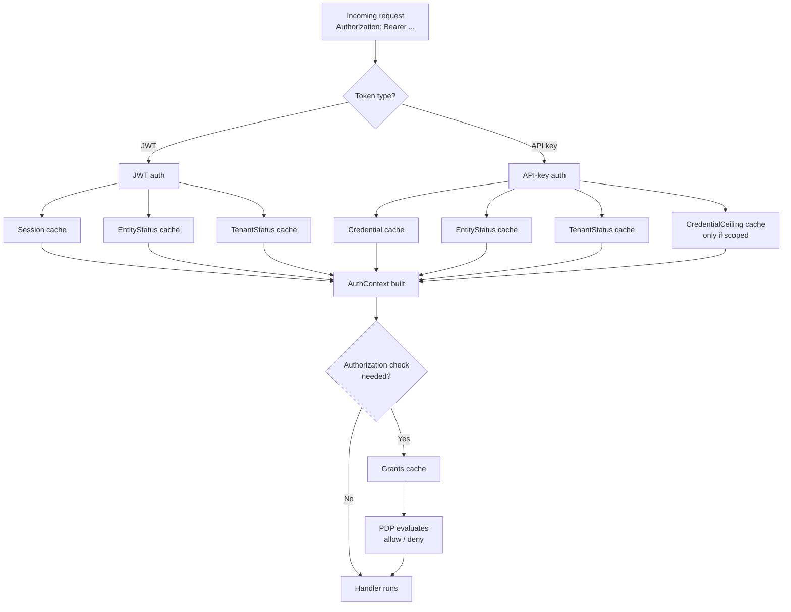
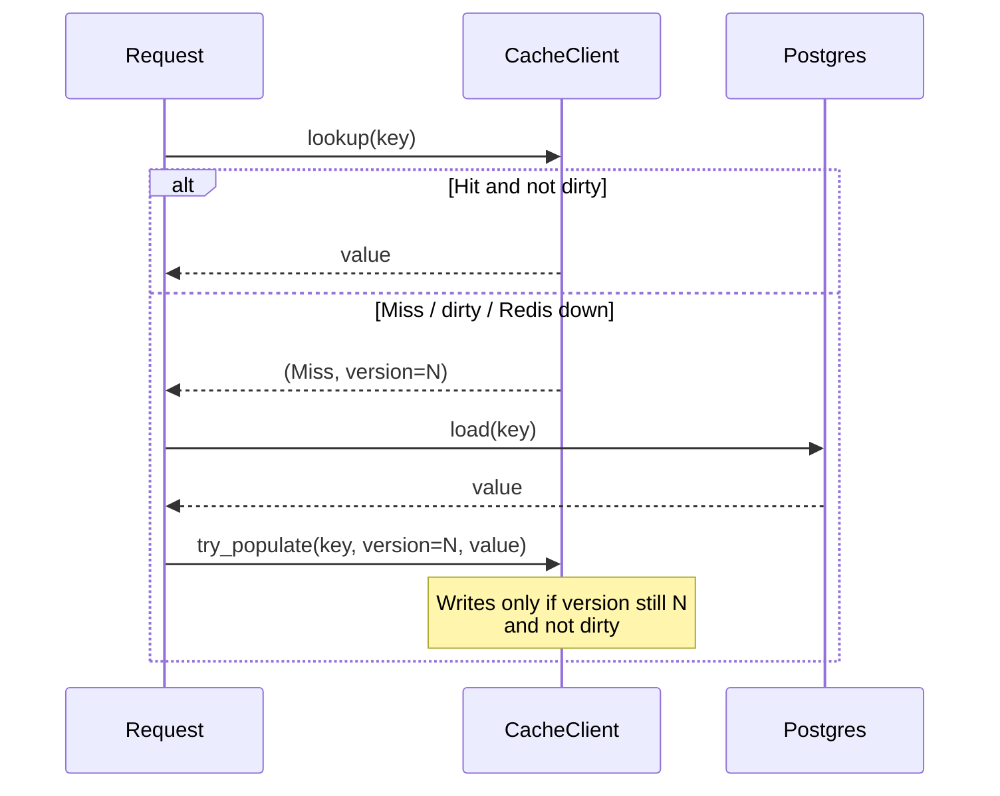
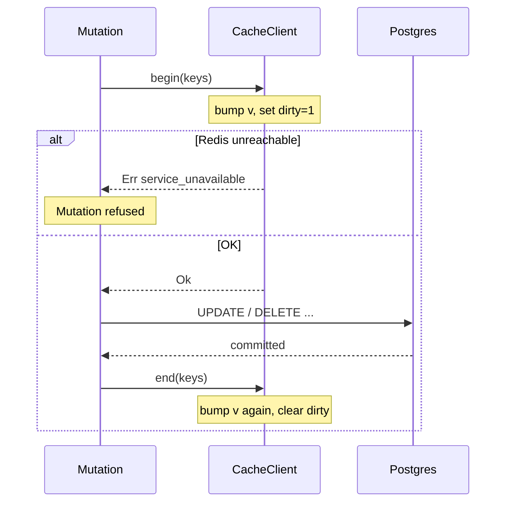

# AuthN / AuthZ Cache

## Status: Active v1
## Date: 2026-07-31

This document describes Atom's Redis-backed cache for authentication and authorization inputs. The source of truth for overall product requirements is [Atom Product Requirements Document](./PRD.md), and authorization terminology is defined in [Atom access model](./11-access-model-simplification.md).

---

## Goal

Atom is often used as an external Identity Provider. Every request from every downstream service hits Atom's auth path. Without a cache, each request costs:

- **JWT auth** — a three-way join (`sessions ⨝ entities ⨝ tenants`).
- **API-key auth** — a three-way join (`credentials ⨝ entities ⨝ tenants`) plus a KDF verification.
- **Every authorization decision** — a recursive CTE call (`subject_effective_grants(uuid)`) that flattens direct policies, role assignments, and group membership.

That is 3–4 Postgres round trips per request, one of them a recursive CTE. Under IdP-scale load this becomes the bottleneck.

The cache targets these hot reads specifically, keeping Postgres as the single source of truth.

---

## Design Principles

1. **Cache inputs, never decisions.** The permit/deny outcome is never cached. Only the raw data the PDP consumes is cached, so a policy change takes effect on the next request without needing to invalidate a combinatorial `(subject, action, object)` space.
2. **Correctness over hit rate.** A revoked token, disabled entity, or removed grant must stop working immediately. Every mutation that could affect a cached value invalidates the affected keys through a race-safe barrier.
3. **Fail-safe reads.** If Redis is unreachable, reads fall through to Postgres. Auth still works — just slower.
4. **Fail-refused writes.** If Redis is unreachable during a security-sensitive Postgres mutation, the mutation is refused. Committing without being able to invalidate the cache would risk serving stale grants after a revoke.
5. **Optional at every layer.** Every call site tolerates `cache: None`. Removing Redis is a config change, not a code change.

---

## What Is Cached

Six categories, each keyed by a UUID under the `atom:v1:` namespace.

| Category | Key format | Payload shape (DTO) | Answers |
|---|---|---|---|
| `Session` | `atom:v1:session:<uuid>` | `SessionCacheEntry` | Is this JWT's session alive? |
| `EntityStatus` | `atom:v1:entity_status:<uuid>` | `EntityStatusCacheEntry` | Is the user active? Which tenant? |
| `TenantStatus` | `atom:v1:tenant_status:<uuid>` | `TenantStatusCacheEntry` | Is the tenant active? |
| `Credential` | `atom:v1:credential:<uuid>` | `CredentialCacheEntry` | API-key hash, status, expiry (never plaintext). |
| `CredentialCeiling` | `atom:v1:cred_ceiling:<uuid>` | `CredentialCeiling` | Scoped-token permission cap. |
| `Grants` | `atom:v1:grants:<subject_uuid>` | `Vec<EffectiveGrant>` | The user's full flattened permission list. |

DTOs are defined in [`src/cache/entries.rs`](../src/cache/entries.rs). Key builders in [`src/cache/keys.rs`](../src/cache/keys.rs).

### What is *not* cached

- **Passwords** — never used on the request path. Used only during `/login`, which mints a JWT; the JWT then uses the `Session` cache.
- **Plaintext API-key secrets** — only the hash used to verify them. See [`CredentialCacheEntry`](../src/cache/entries.rs#L49).
- **The authorization decision itself** — the PDP evaluates conditions per request against fresh (or freshly cached) grants.
- **Audit writes** — always go to Postgres.

---

## How AuthN / AuthZ Use the Cache

The three layers of a request, and which cache each layer hits:



- JWT auth: [`src/auth.rs`](../src/auth.rs) around `auth_from_jwt`.
- API-key auth: [`src/auth.rs`](../src/auth.rs) around `auth_from_api_key`.
- Grants load: [`src/auth.rs`](../src/auth.rs) `AuthContext::effective_grants` and [`src/authz/engine.rs`](../src/authz/engine.rs) inside `load_decision_context`.

The auth hot path reads its independent keys (session/entity/tenant for JWT, credential/entity/tenant for API-key) in **one pipelined round trip on a single pooled connection** via `CacheClient::lookup_many` + `CacheClient::decode` — see [`src/cache/mod.rs`](../src/cache/mod.rs). Issued one at a time it would be three pool acquisitions and three serial round trips, each bounded by `op_timeout`, before any request work started.

---

## Consistency Model

Every cached entry is a Redis hash with three fields:

- `v` — an integer version, bumped on every mutation that could affect the entry.
- `dirty` — `"1"` while a mutation is in flight, absent otherwise.
- `p` — the serialized payload, present only when the entry holds a valid value.

Three atomic Lua scripts implement a per-key **mutation barrier** that closes three otherwise-unavoidable races.

### The three primitives

| Primitive | When it runs | What it does |
|---|---|---|
| `begin` | Before a security-sensitive Postgres mutation | Bumps `v`, sets `dirty=1`, clears `p`. Fails the mutation if Redis is unreachable. |
| `end` | After the mutation (success or failure) | Bumps `v` again, clears `dirty`. Best-effort. |
| `try_populate` | After a cache-miss reader finishes loading from Postgres | Writes the payload only if `dirty=0` **and** `v` still equals what the reader observed pre-load; otherwise discards silently. |

### Read path



### Write path (mutation)



### The races this prevents

1. **Read-before-mutation.** A reader observes version `N`, starts loading from Postgres; a mutation runs to completion, bumping to `N+2`. The reader's `try_populate` presents `N` — rejected on version mismatch.
2. **Read-during-dirty-window.** A reader lands while `dirty=1`, observes the post-`begin` version. `end`'s **second** version bump ensures that observed version is stale by the time `try_populate` runs — rejected either by the dirty check (if still dirty) or the version check (if `end` already ran).
3. **Lost-invalidation.** If `end` never runs (crash), the barrier TTL causes the whole entry to expire rather than being stuck dirty forever. `end` re-applies `PEXPIRE` on the entry, since `HINCRBY` would otherwise recreate an already-expired key and leave it immortal.
4. **Cross-key poisoning during populate.** A miss loader whose returned payload describes a *different* key than the one being populated must never write across keys — e.g. the JWT miss loader joins tenants through `entities.tenant_id`, so it returns the entity's *current* tenant's status, which is not necessarily the tenant the token's `tid` claim points to when the token outlived a tenant move. Populates now write only when the observed version's key matches the key the payload describes.

The first primitive that fails self-heals: `begin` failing refuses the mutation; `end` failing leaves the entry dirty until barrier-TTL expiry; `try_populate` failing just leaves the entry as a miss for the next reader to reload.

---

## Invalidation Map

Which mutation invalidates which category:

| Mutation | Invalidates | Where |
|---|---|---|
| Logout | `Session` | [`src/identity/handlers.rs`](../src/identity/handlers.rs) |
| Password reset | `Session` (bulk, per active session) | [`src/identity/service.rs`](../src/identity/service.rs) |
| Entity update | `EntityStatus` | [`src/graphql/entities.rs`](../src/graphql/entities.rs) |
| Entity activate / deactivate | `EntityStatus` | [`src/identity/handlers.rs`](../src/identity/handlers.rs) |
| Entity delete | `EntityStatus` + `Session` + `Credential` | [`src/graphql/entities.rs`](../src/graphql/entities.rs) |
| Entity restore | `EntityStatus` | [`src/graphql/entities.rs`](../src/graphql/entities.rs) |
| Tenant update | `TenantStatus` | [`src/graphql/tenants.rs`](../src/graphql/tenants.rs) |
| Tenant delete | `TenantStatus` + child `Session`s | [`src/graphql/tenants.rs`](../src/graphql/tenants.rs) |
| Tenant restore | `TenantStatus` + reactivated `Credential`s | [`src/graphql/tenants.rs`](../src/graphql/tenants.rs) |
| Tenant create / purge | `Grants` (of acting subject) | [`src/graphql/tenants.rs`](../src/graphql/tenants.rs) |
| Credential revoke / rotate | `Credential` | [`src/graphql/credentials.rs`](../src/graphql/credentials.rs), [`src/identity/handlers.rs`](../src/identity/handlers.rs) |
| Credential scope change | `CredentialCeiling` | [`src/graphql/credentials.rs`](../src/graphql/credentials.rs) |
| Role assignment (create / delete) | `Grants` for each affected subject | [`src/graphql/policies.rs`](../src/graphql/policies.rs) |
| Direct policy (create / delete) | `Grants` for the subject | [`src/graphql/policies.rs`](../src/graphql/policies.rs) |
| Role permission-block change | `Grants` for every assignee of the role | [`src/graphql/policies.rs`](../src/graphql/policies.rs) |
| Group membership change (REST or GraphQL) | `Grants` for every member of the group closure | [`src/graphql/groups.rs`](../src/graphql/groups.rs), [`src/identity/handlers.rs`](../src/identity/handlers.rs) |

The REST paths (`delete_entity`, `add_group_member`, `remove_group_member`) invalidate through the same helpers as the GraphQL resolvers — entity deletion is consolidated into a single service entry point at [`src/identity/service.rs`](../src/identity/service.rs), and both group-member handlers wrap their mutation in `guarded_mutation`.

### Race-safe enumeration

Group and role invalidations must enumerate **who is affected** (every entity in a group closure, every assignee of a role). If enumeration happens outside a transaction, a concurrent `add_group_member` can slip a new member in *between* enumeration and mutation — that new member's `grants` key is never invalidated, and a stale entry survives until TTL.

To close this, the enumeration functions lock the relevant rows `FOR UPDATE` inside the caller's transaction:

- [`lock_group_closures_and_collect_grants_keys`](../src/authz/repo.rs) — locks every group in the closure of the given roots (id-sorted, so it cannot deadlock against itself), then returns the affected `grants` keys.
- [`lock_role_and_collect_grants_keys`](../src/authz/repo.rs) — locks the role row, then locks the closure of every group assigned to it.

Callers pair these with `guarded_tx_mutation` (see below) rather than `guarded_mutation`, because the enumeration must happen inside the same open transaction as the mutation itself.

---

## API Surface

### Reading

```rust
// Cache-aside with a fallback loader. Callers use this at read sites.
crate::cache::cached_or_load(
    cache,                                    // Option<&CacheClient>
    CacheCategory::Grants,
    &cache::keys::grants(subject_id),
    || repo::effective_grants_for_subject(pool, subject_id),
).await?
```

Defined at [`src/cache/mod.rs`](../src/cache/mod.rs) `cached_or_load`. Tolerant of `cache: None` — falls through to `loader`.

### Writing (single category, single call site)

```rust
crate::cache::invalidate::guarded_mutation(
    cache,
    CacheCategory::Credential,
    std::slice::from_ref(&cache::keys::credential(credential_id)),
    || async { /* Postgres mutation */ },
).await?
```

Defined at [`src/cache/invalidate.rs`](../src/cache/invalidate.rs) `guarded_mutation`.

### Writing (single-category, mutation owns a `Transaction`)

Use `guarded_tx_mutation` when the affected keys can only be enumerated **under the locks the mutation itself takes** — every group-closure and role mutation. It opens the transaction, runs `collect_keys` (which locks and enumerates), establishes the barrier on that key set, runs `mutate` on the same transaction, commits, and clears the barrier — in that fixed order, regardless of outcome. Stable Rust has no async closures, so the closures return a boxed future borrowing the transaction:

```rust
crate::cache::invalidate::guarded_tx_mutation(
    cache,
    CacheCategory::Grants,
    &state.pool,
    |tx| Box::pin(async move {
        authz_repo::lock_group_closures_and_collect_grants_keys(tx, &[group_id]).await
    }),
    |tx| Box::pin(async move { do_mutation_in_tx(tx).await }),
).await?
```

Defined at [`src/cache/invalidate.rs`](../src/cache/invalidate.rs) `guarded_tx_mutation`. Callers hold the `cache: None` fallback themselves because the uncached path is usually a different repo function (typically the non-`_in_tx` variant that opens its own transaction).

### Writing (multi-category, mutation owns a `Transaction`)

Use `begin_all` / `end_all` for mutations spanning several categories on one open transaction (e.g. `deleteEntity` invalidates `EntityStatus` + `Session` + `Credential`):

```rust
let mut tx = pool.begin().await?;
let (session_ids, credential_ids) =
    repo::deactivate_entity_and_collect_revocation_ids_in_tx(&mut tx, id, deleted_by).await?;
let session_keys: Vec<String> = session_ids.iter().map(|id| keys::session(*id)).collect();
let credential_keys: Vec<String> = credential_ids.iter().map(|id| keys::credential(*id)).collect();
let entity_status_keys = [keys::entity_status(id)];
let groups = [
    (CacheCategory::EntityStatus, entity_status_keys.as_slice()),
    (CacheCategory::Session,      session_keys.as_slice()),
    (CacheCategory::Credential,   credential_keys.as_slice()),
];

cache::invalidate::begin_all(cache, &groups).await?;
let outcome = repo::finish_entity_deletion_in_tx(&mut tx, id).await;
let outcome = match outcome {
    Ok(()) => tx.commit().await,
    Err(e) => Err(e),
};
cache::invalidate::end_all(cache, &groups).await;
outcome?
```

---

## Failure Modes

| Failure | Behaviour | Impact |
|---|---|---|
| Redis unreachable at startup | `main.rs` decides fail-fast vs degrade (see `ATOM_CACHE_REQUIRED`). | Startup fails or logs a warning. |
| Redis unreachable during read | Treated as `Lookup::Unavailable`. Falls through to Postgres loader. | Auth works, slower. |
| Redis unreachable during `begin` | Mutation refused with `503 service_unavailable`. | The mutation does not commit. |
| Redis unreachable during `end` | Best-effort — logged, not surfaced. Entry stays dirty until barrier TTL. | Entry reloads on next reader; slight perf hit until then. |
| Redis unreachable during `try_populate` | Best-effort — dropped silently. | Next reader still gets a miss and retries. |
| Corrupt payload | Treated as a miss and the entry is deleted so the next read reloads clean. | One extra Postgres round trip. |

---

## Configuration

Set via environment variables — see [`.env.example`](../.env.example) for the full list.

| Variable | Meaning |
|---|---|
| `ATOM_CACHE_ENABLED` | Master switch. `false` disables all caching (call sites pass `cache: None`). |
| `ATOM_CACHE_REDIS_URL` | Redis connection URL. |
| `ATOM_CACHE_POOL_MAX_SIZE` | Max Redis connections. |
| `ATOM_CACHE_CONNECT_TIMEOUT_MS` | Startup PING timeout. |
| `ATOM_CACHE_OP_TIMEOUT_MS` | Per-operation timeout. |
| `ATOM_CACHE_TTL_SESSION_SECS` | TTL for `Session` entries. |
| `ATOM_CACHE_TTL_ENTITY_STATUS_SECS` | TTL for `EntityStatus` entries. |
| `ATOM_CACHE_TTL_TENANT_STATUS_SECS` | TTL for `TenantStatus` entries. |
| `ATOM_CACHE_TTL_CREDENTIAL_SECS` | TTL for `Credential` entries. |
| `ATOM_CACHE_TTL_CREDENTIAL_CEILING_SECS` | TTL for `CredentialCeiling` entries. |
| `ATOM_CACHE_TTL_GRANTS_SECS` | TTL for `Grants` entries. |

Config struct: [`src/config.rs`](../src/config.rs) `CacheConfig` / `CacheTtlConfig`.

TTLs are the residual staleness bound if invalidation is missed entirely (e.g. barrier TTL expired before `end` completed). They should be short enough that a missed invalidation is a bounded outage, not an indefinite one.

---

## Metrics

All cache operations emit metrics through [`src/metrics.rs`](../src/metrics.rs):

| Metric | Labels | Values |
|---|---|---|
| `atom_cache_lookup_total` | `category`, `outcome` | `hit`, `miss`, `error` |
| `atom_cache_invalidation_total` | `category`, `outcome` | `ok`, `error` |
| `atom_cache_populate_total` | `category`, `outcome` | `applied`, `stale`, `error` |

Category labels are fixed enum variants, so cardinality is bounded.

The populate metric splits `applied` (the write took) from `stale` (rejected by the barrier: dirty entry, or the version moved since the caller's `lookup`). A hit rate stuck at zero can then be told apart from every write being rejected by a stuck barrier — otherwise indistinguishable.

---

## Extending — Adding a New Cached Category

The cache client (Redis pool, Lua scripts, barrier, timeouts, metrics) is fully generic. Only the **registry** of categories is centralised. To add a new one:

1. Add a variant to `CacheCategory` in [`src/cache/mod.rs`](../src/cache/mod.rs), plus cases in `as_str()` and `ttl()`.
2. Add a `<name>_secs: u64` field to `CacheTtlConfig` in [`src/config.rs`](../src/config.rs), and a matching env var.
3. Add a key builder to [`src/cache/keys.rs`](../src/cache/keys.rs).
4. (Optional) add a DTO to [`src/cache/entries.rs`](../src/cache/entries.rs) — the client is generic over any `Serialize + DeserializeOwned` type, so a bespoke DTO is only needed if the DB row shape is not directly usable.
5. At each read site: call `cached_or_load(cache, CacheCategory::<New>, &keys::<new>(id), || loader)`.
6. At each write site that could affect the entry: wrap the mutation in `guarded_mutation` (or `begin_all` / `end_all` if the mutation owns an open `Transaction`).

The design is deliberately explicit — the enum is not `Other(String)` — because:

- Bounded label cardinality keeps metrics well-behaved.
- All TTLs are auditable in one file.
- No handler can silently invent a new cache category that collides with an existing one.

---

## Testing

- **Barrier semantics (Redis-gated unit tests):** [`src/cache/mod.rs`](../src/cache/mod.rs) `#[cfg(test)] mod tests`. Includes tests for both the read-before-mutation race and the read-during-dirty-window race.
- **End-to-end invalidation matrix:** [`tests/m25_cache_invalidation.rs`](../tests/m25_cache_invalidation.rs). Covers every mutation → invalidation pairing listed above.

Both suites are `#[ignore]` and require `ATOM_TEST_REDIS_URL`; run with `cargo test -- --include-ignored`.

---

## Related Documents

- [Atom Product Requirements Document](./PRD.md)
- [Atom access model](./11-access-model-simplification.md)
- [Scoped Access Tokens](./13-access-tokens.md)
